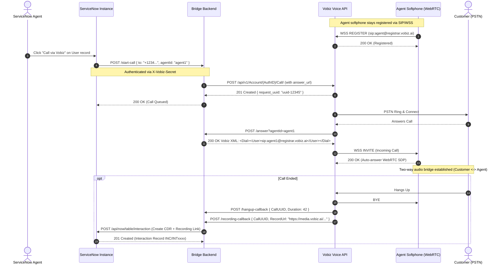

# Vobiz ServiceNow Calling Bridge: System Architecture

## 1. Executive Summary & Architecture Paradigm

The **Vobiz ServiceNow Calling Bridge** enables seamless Click-to-Call, real-time voice streaming, automatic Call Detail Record (CDR) logging, and in-platform call recording playback for ServiceNow CRM users.

### The "Browser-as-a-Leg" Paradigm
Traditional telephony integrations require agents to maintain physical IP desk phones, install heavyweight native desktop CTI softphones, or connect through complex third-party telephony PBXs. 

In this architecture:
- The **agent's web browser tab acts directly as a native SIP/WebRTC call leg** ("Browser-as-a-Leg").
- Signaling travels over secure WebSockets (`wss://registrar.vobiz.ai:5063`), while audio media streams directly peer-to-peer via SRTP/WebRTC.
- When an agent triggers a call in ServiceNow, the backend coordinates the two call legs:
  1. **A-Leg**: The customer's PSTN phone line, dialed via Vobiz Voice REST API.
  2. **B-Leg**: The agent's browser softphone, dialed via SIP URI over WebSocket into JsSIP.
- Both legs are bridged instantaneously with sub-100ms latency.

---

## 2. High-Level System Architecture Diagram

```
┌─────────────────────────────────────────────────────────────────────────────────────────────────────────┐
│                                             SERVICENOW CLOUD                                            │
│                                                                                                         │
│   ┌────────────────────────────────┐                ┌───────────────────────────────────────────────┐   │
│   │   sys_user / customer_contact  │                │               interaction Table               │   │
│   │       Form View (Records)      │                │           (Call Logs, Durations,              │   │
│   │  [ Button: "Call via Vobiz" ]  │                │            Recording Hyperlinks)              │   │
│   └───────────────┬────────────────┘                └───────────────────────▲───────────────────────┘   │
│                   │                                                         │                           │
│                   │ 1. REST Message (POST)                                  │ 8. Table API (POST)       │
│                   ▼                                                         │                           │
│   ┌────────────────────────────────┐                                        │                           │
│   │   ServiceNow System Properties │                                        │                           │
│   │    - vobiz.calling.tunnel_url  │                                        │                           │
│   │    - vobiz.calling.shared_secret                                        │                           │
│   └────────────────────────────────┘                                        │                           │
└───────────────────┼─────────────────────────────────────────────────────────┼───────────────────────────┘
                    │                                                         │
                    │ HTTPS (Public Tunnel / Reverse Proxy)                   │
                    ▼                                                         │
┌─────────────────────────────────────────────────────────────────────────────┼───────────────────────────┐
│                                   VOBIZ SERVICENOW CALLING BRIDGE BACKEND   │                           │
│                                                                             │                           │
│   ┌───────────────────────────────┐     Signaling & CDRs     ┌──────────────┴───────────────────────┐   │
│   │     POST /start-call          ├─────────────────────────►│         Interaction Logger           │   │
│   │     (Validates shared secret) │                          │   (createServiceNowInteraction)      │   │
│   └───────────────┬───────────────┘                          └──────────────────────▲───────────────┘   │
│                   │                                                                 │                   │
│                   │ 2. Outbound REST                                                │ 7. Hangup Event   │
│                   ▼                                                                 │    + Duration     │
│   ┌───────────────────────────────┐     5. Vobiz XML Dial    ┌──────────────────────┴───────────────┐   │
│   │   POST /answer Webhook        │◄─────────────────────────┤       POST /hangup-callback          │   │
│   │   (<Dial><User>sip:agent</User>)                         │       POST /recording-callback       │   │
│   └───────────────────────────────┘                          └──────────────────────▲───────────────┘   │
│                   │                                                                 │                   │
│                   │ Proxy Recording Stream                                          │ 6. Recording File │
│                   ▼                                                                 │    Generated      │
│   ┌───────────────────────────────┐                                                 │                   │
│   │   GET /recording-audio/<id>   ├─────────────────────────────────────────────────┤                   │
│   │   (Expiring signed streaming) │                                                 │                   │
│   └───────────────────────────────┘                                                 │                   │
└───────────────────┼─────────────────────────────────────────────────────────────────┼───────────────────┘
                    │                                                                 │
                    │ HTTPS REST APIs & Webhooks                                      │
                    ▼                                                                 │
┌─────────────────────────────────────────────────────────────────────────────────────┼───────────────────┐
│                                      VOBIZ CLOUD TELEPHONY PLATFORM                 │                   │
│                                                                                     │                   │
│   ┌───────────────────────────────┐   SIP WebSocket (WSS)    ┌──────────────────────┴───────────────┐   │
│   │    Vobiz Core REST Engine     ├─────────────────────────►│       Vobiz SIP Registrar & B2BUA    │   │
│   │    (api.vobiz.ai)             │                          │       (registrar.vobiz.ai:5063)      │   │
│   └───────────────┬───────────────┘                          └──────────────────────┬───────────────┘   │
└───────────────────┼─────────────────────────────────────────────────────────────────┼───────────────────┘
                    │                                                                 │
                    │ 3. PSTN Dial                                                    │ 4. WebRTC Audio
                    ▼                                                                 ▼
      ┌───────────────────────────┐                                     ┌───────────────────────────┐
      │      Customer Phone       │                                     │  Agent Browser Softphone  │
      │   (Mobile / Landline)     │                                     │ (WebRTC / JsSIP In-Tab)   │
      └───────────────────────────┘                                     └───────────────────────────┘
```

---

## 3. End-to-End Call Lifecycle & Sequence Diagram



---

## 4. Component Deep Dive

### 4.1. ServiceNow Layer (`servicenow-app/`)
- **Form Action Button (`sys_ui_action`)**: Added to relevant forms (`sys_user`, `customer_contact`, `sn_customerservice_case`, `incident`).
- **Dynamic Configuration (`sys_properties`)**:
  - `vobiz.calling.tunnel_url`: The public hostname of the backend bridge.
  - `vobiz.calling.shared_secret`: Symmetric authentication token passed in `X-Vobiz-Secret`.
- **System Table Integration**:
  - Automatically queries `sys_user` to resolve the logged-in agent's `sys_id`.
  - Automatically writes CDRs into the `interaction` table (or custom CDR table), linking caller number, call duration, timestamp, assigned agent, and the proxied audio recording link.

### 4.2. Backend Integration Bridge (`backend/`)
- **Stateless Signaling & Session Cache**:
  - Tracks active call UUIDs (`activeCalls` memory map) across the asynchronous lifecycle: `start-call` -> `answer` -> `recording-callback` -> `hangup-callback`.
- **Zero-Trust Security**:
  - Vobiz Auth ID and Auth Token never leave the backend `.env` boundary.
  - No secret tokens are stored in browser client scripts or ServiceNow form scripts.
- **Audio Recording Proxy**:
  - `GET /recording-audio/<recordingId>` streams recordings. The caller names an
    id, never a URL: the backend resolves the media URL through the Vobiz API,
    refuses any host off an allowlist, re-checks after every redirect, and drops
    its own auth headers on the way to presigned storage. Links are HMAC-signed
    with a short expiry, because they end up in ServiceNow work notes.

### 4.3. Softphone Client (`agent-phone/` / CTI Frame)
- **WebRTC Native Audio**:
  - Utilizes JsSIP over WebSockets (`wss://registrar.vobiz.ai:5063`).
  - Seamless auto-answer capability for bridged calls.
  - Audio device constraints optimized for speech codecs (Opus/PCMU).

---

## 5. Security & Compliance Architecture

| Threat / Risk | Mitigation Mechanism |
| :--- | :--- |
| **Vobiz Credential Leakage** | `VOBIZ_AUTH_ID` and `VOBIZ_AUTH_TOKEN` reside strictly on the backend Node.js server. Neither ServiceNow client scripts nor agents have access. |
| **Unauthorized Call Triggering** | `/start-call` requires `X-Vobiz-Secret` (matching `VOBIZ_SHARED_SECRET`) or a session. It is never open: a server with no secret configured refuses rather than accepting anyone. |
| **Plain-Text Credential Logging** | Console logs mask passwords and tokens; sanitized startup reporting verifies connectivity without printing secrets. |
| **Public Recording Exposure** | Playback links are HMAC-signed and expire. The stream endpoint takes a recording id, resolves the URL server-side, and enforces a host allowlist — a caller cannot name the destination the account credentials are sent to. |
| **Cross-Origin Abuse** | CORS is an allowlist (`*.service-now.com`, localhost, `ALLOWED_ORIGINS`). A wildcard would let any page on the internet drive this server. |
| **Credential Disclosure via Metadata** | `/health` and `/session` report configuration state, not account identifiers. SIP credentials are served only to a signed-in caller and never written into the committed `agents.json`. |
| **PII & Data Retention** | CDR records store standard call metadata (From, To, Duration, Timestamp). Phone numbers are handled over TLS in transit. |

---

## 6. Deployment Topologies

### Topology A: Local Development & Proof-of-Concept
```
ServiceNow (Cloud) ──HTTPS──> Cloudflare Tunnel ──HTTP──> Local Node.js (Port 8092)
```

### Topology B: Production Enterprise Deployment
```
ServiceNow (Cloud) ──HTTPS──> Enterprise Ingress / AWS ALB ──HTTPS──> Containerized Bridge (ECS/K8s)
                                                                           │
                                                                           ▼
                                                              Vobiz Cloud Platform
```
